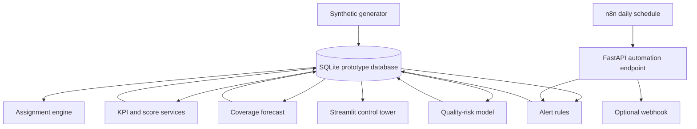
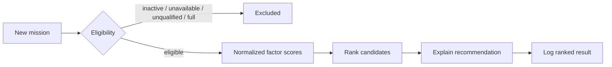

# Architecture

## Runtime view

## Decision sequence

## Boundaries

- `synthetic.py` owns reproducible demonstration-data generation.
- `kpis.py` owns measurement definitions and aggregation.
- `scoring.py` owns reliability normalization, confidence and tiers.
- `coverage.py` owns short-horizon demand and allocated capacity.
- `assignment.py` owns hard eligibility and soft ranking.
- `quality.py` owns model training, temporal holdout validation and assessment.
- `alerts.py` owns rule evaluation, deduplication and resolution.
- Streamlit pages contain presentation logic only.

SQLite provides a portable demo with no infrastructure dependency. PostgreSQL is the recommended next step when multiple deployed services need concurrent, durable access.

